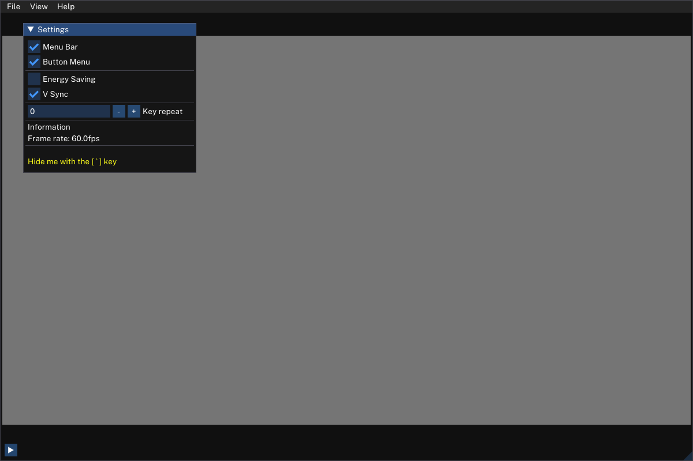

# Slides - Slideshows for Hackers 

This project is both a case study and also marks my first steps in [Zig](https://ziglang.org), towards creating a simple but powerful [imgui](https://github.com/ocornut/imgui/wiki#about-the-imgui-paradigm) based, OpenGL-rendered slideshow app in Zig.

**Danger - this is alpha stuff**. I have used it to give a few presentations in online meetings though and nobody seemed to have noticed that I hadn't used Powerpoint.

This app will be much simpler for users than my more powerful take on the matter, [Bûllets](https://github.com/renerocksai/bullets), while still being totally functional.
 
If you want to play with it you can download the current release from the releases section on GitHub. I will release versions as I see fit. Since releasing requires me to boot into Windows, it won't happen too often, though.


## Highlights:
- Presentations are created in a simple text format, see below.
  - makes your slides totally GitHub-friendly
- One single (mostly static) executable - no install required.
  - for Windows, Linux (and Mac, if you build it yourself)
- Built-in editor: create, edit, and present with one small program
- support for clickers
- virtual laser pointer in different sizes


See it in action: We open a slideshow, go through the slides, activate the laserpointer, open the editor, make and save changes to the subtitle of the last slide, then close the editor.


https://user-images.githubusercontent.com/30892199/118730194-83dddf00-b837-11eb-988a-677a63f5d139.mp4


# Motivation 

Apart from all the reasons to ditch Powerpoint that applied to my previous slideshow project [Bûllets](https://github.com/renerocksai/bullets) which I already outlined there, this time I wanted to create something more portable, easier to get started with, without external dependencies, that also allows for super quick slide creation using a simple text format.

In addition, this project also serves as a case study for myself where I test out how feasible it is to develop GUI apps in zig, using OpenGL and an immediate mode GUI like dear imgui.

This project achieves what I set out for in the following ways:

- **portability:** zig allows for cross-platform development. If it weren't for OpenGL and SDL dependencies, even cross-compilation for all platforms would work out of the box. While that can probably be solved, I am OK with building releases on two platforms for now.
    - the result is a free-standing executable, only a few MB in size that needs no installer
- **easy to get started with:** just download, start and go!
- **no external dependencies:** all you need to create presentations is the program itself. No other software is required. The builtin editor is not the greatest but since slides watches your files, you can use an external editor, too. Changes will be loaded everytime you save.
- **super quick slide creation:** a simple text format supporting basic Markdown syntax (plus underlines) and templates for building blocks lets you type formatted bulleted lists very quickly.
    - you can also paste in Markdown from your note taking app, which is what I do frequently
 
## Interesting Observations 

Using slides, I far more enjoy creating slideshow presentations. It seems to trick my mind into a more enjoyable, programming-like state when I spend my time in neovim, using the slideshow description / markup language. It is a completely mouse-less way of creating presentations. I find it very effective. I also really like that I can put my presentations and supporting assets in a git reposiory and have them version-controlled. 

Lots of the contents of my slideshows is Markdown or very Markdown-friendly which makes re-use of information snippets really handy, e.g. from notes to presentation to blog post.  

BTW, I use `imgtool.py`, also contained in the repo, for figuring out image sizes and placement.  Make sure you have some PIL installed.

# Usage

After starting slides by double-clicking it or launching it from the command line, you will be greeted with an empty window. 



Use the menu or keyboard shortcuts (see below) to load the sample presentation `test_public.sld`. Alternatively, go straight to the built-in editor as described further down.

## Opening a Slideshow

Usually, you want to open an existing slideshow for editing or presentation purposes. If you want to experiment with a new slideshow, just open the editor with the <kbd>E</kbd> key and fire away. To make the changes take effect, save the presentation using the save button or the keyboard shortcut <kbd>Ctrl</kbd> + <kbd>S</kbd>. 

To open an existing slideshow, use the menu or the keyboard shortcut <kbd>Ctrl</kbd> + <kbd>O</kbd> and then pick a file from the file browser. 

## Editing and Saving a Slideshow
You open the built-in editor with the <kbd>E</kbd> key. Note that the editor will not be active for text input with a blinking cursor immediately. This allows you to navigate through the slides until you have reached the one you want to edit. As you navigate through the slides, the editor will follow by moving the current slide's `@popslide` or `@slide` command into the visible area and quickly flashing it with a red background once.

You enter the editor by clicking somewhere into the text and leave it by clicking somewhere outside of the text. To hide the editor, just use the `[e] editor` button or press the <kbd>E</kbd> key again. 

To make the changes you made take effect, save the presentation using the save button or the keyboard shortcut <kbd>Ctrl</kbd> + <kbd>S</kbd>. 

**Note:** You can resize the editor pane by dragging it by the lighter blue handle that separates slide content from the editor in the vertical center of the editor:


**Note:** The internal editor is not suitable for smooth and comfortable editing, as it only covers the basic feartures of an editor. For authoring presentations, I recommend using a real editor. I prefer neovim - but you know best what works for you. Slides watches the file of the open presentation and reloads it when you save it in your editor of choice.


## Presentation and Slide Navigation
See the next section for keyboard shortcuts for slideshow control and slide navigation. In addition to using the keyboard, you can also use a "clicker" / "presenter" device.

## Keyboard Shortcuts 

| Shortcut | Description |
| -------- | ----------- |
| <kbd>Ctrl</kbd> + <kbd>N</kbd> | New file |
| <kbd>Ctrl</kbd> + <kbd>O</kbd> | Open file |
| <kbd>Ctrl</kbd> + <kbd>S</kbd> | Save file |
| <kbd>Ctrl</kbd> + <kbd>Q</kbd> | Quit |
| <kbd>E</kbd> | Toggle editor |
| <kbd>F</kbd> | Toggle fullscreen |
| <kbd>Ctrl</kbd> + <kbd>L</kbd> | Toggle laserpointer |
| <kbd>Ctrl</kbd> + <kbd>Shift</kbd> + <kbd>L</kbd> | cycle through laserpointer sizes |
| <kbd>M</kbd> | Toggle on-screen menu buttons |
| <kbd><</kbd> | Goto previous slide |
| <kbd>PgUp</kbd> | Goto previous slide |
| <kbd>Backspace</kbd> | Goto previous slide |
| <kbd>></kbd> | Goto next slide |
| <kbd>PgDown</kbd> | Goto next slide |
| <kbd>Space</kbd> | Goto next slide |
| <kbd>1</kbd> | Goto first slide |
| <kbd>0</kbd> | Goto last slide |

# Slideshow Text Format 
Example of the current text format - see `test_public.sld` for a more realistic example:

```
# -------------------------------------------------------------
# --define intro slide template
# -------------------------------------------------------------

# Background image
@bg img=assets/nim/1.png

# or for a simple colored background:
# @bg color=#000000000

# lines starting with a # sign are comments BTW

# title, subtitle, authors
@push intro_title    x=0 y=0 w=100 h=100 fontsize=16 color=#123456aa 
@push intro_subtitle x=0 y=0 w=100 h=100 fontsize=16 color=#123456aa 
@push intro_authors  x=0 y=0 w=100 h=100 fontsize=16 color=#123456aa 

# the following pushslide command will cause everything up to here to be 
# "remembered as template" named `intro`, it will not be rendered immediately
@pushslide intro     fontsize=16 bullet_color=#12345678 color=#bbccddee


# #############################################################
# ##   S  L  I  D  E  S
# #############################################################

# -------------------------------------------------------------
# Intro slide
# -------------------------------------------------------------
@popslide intro
@pop intro_title    text=**Slides** - Slideshows for Hackers
@pop intro_subtitle text=A prototype
@pop intro_authors text=@renerocksai

# -------------------------------------------------------------
# Some slide without slide template
# -------------------------------------------------------------
@slide

# some image on the slide 
@box img=some_image.png x=800 y=100 w=320 h=200  

@box x=100 y=100 w=1720 h=880
Here come the bullets:
- first
    - some details
- second
- <#808080ff>third</> in a different color

```


# Building it
## prerequisites


Clone [zig-upaya](https://github.com/prime31/zig-upaya):

```bash
$ git clone --recursive https://github.com/prime31/zig-upaya/
```
Clone this repository:

```bash
$ git clone renerocksai/slides
```

Create a link to zig-upaya:

```bash
$ cd slides
$ ln -s ../zig-upaya
```

If you name the link differently, then modify the following line in `build.zig` accordingly:

```zig
const upaya_dir = "./zig-upaya/";
```

... and also this line in `src/main.zig`:

```zig
const Texture = @import("../zig-upaya/src/texture.zig").Texture;
```


Note: On Windows, you probably have to move the entire `zig-upaya` directory into the `slides` directory.

## build and run

```bash
$ zig build slides
```

To just build: `zig build`. This will create the executable `slides` in `./zig-cache/bin/`.

## Tested with: 
- zig `0.8.0-dev.1120+300ebbd56`
- zig `0.8.0-dev.1141+68e772647`
- zig-upaya [prime31/zig-upaya@154417379bfaa36f51c3b1b438fa73cf563d90f0](https://github.com/prime31/zig-upaya/commit/154417379bfaa36f51c3b1b438fa73cf563d90f0).

