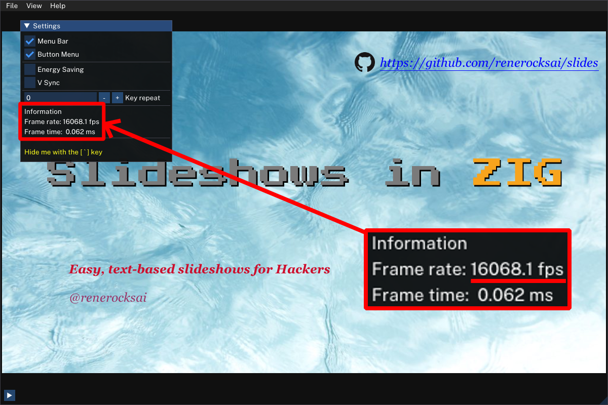
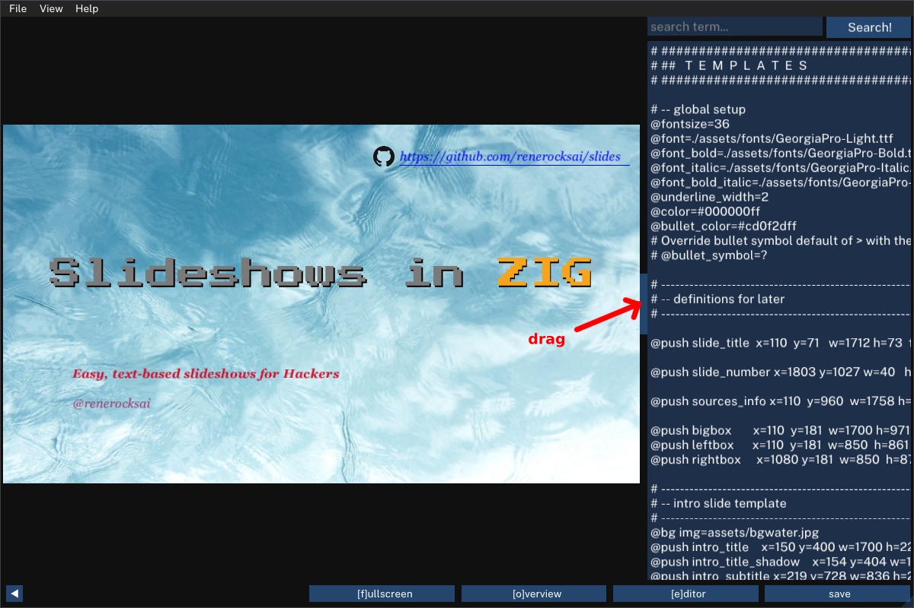

# Slides - Slideshows for Hackers

This project is both a case study and also marks my first steps in the programming language [Zig](https://ziglang.org), towards creating a simple but powerful [imgui](https://github.com/ocornut/imgui/wiki#about-the-imgui-paradigm) based, OpenGL-rendered slideshow app in Zig.

**Danger - this is alpha stuff**. I have used it to give quite a few presentations in online meetings though and nobody seemed to have noticed that I hadn't used Powerpoint. It is my zig programming toy - please don't be disappointed if it doesn't do everything you expect. Also, currently Windows builds are a work in progress due to unresolved libpng dependencies. See [building it](#building-it).

This app is supposed to be much simpler and quicker to use (for people like me) than my more powerful take on the whole slideshow matter, [Bûllets](https://github.com/renerocksai/bullets), while still being totally functional. The reason for increased ease of use and speed is that, with slides, entire slideshows can be expressed in an easy text format, and it can also be used in tandem with an external text editor such as [neovim](https://neovim.io/).

If you want to play with _slides_ you can download the current release from the [releases section](https://github.com/renerocksai/slides/releases) on GitHub. I will release versions as I see fit.


## Highlights

- Presentations are created in a simple text format, see below.
  - makes your slides totally GitHub-friendly
- One single (mostly static) executable - no install required.
  - for Windows, Linux (and Mac, if you build it yourself)
- Built-in editor: create, edit, and present with one small program - or make last-minute changes while presenting
- support for clickers
- virtual laser pointer in different sizes
- export slideshow to PNGs with a single key-press
- inspector gadget: view and modify render elements

### Rendering Slideshows at 10 000 FPS

Slides is FAST (gotta go fast)! It pre-renders slideshows into easy to execute
drawing structures on load and save, so that the actual rendering takes as
little time as necessary. Rendering the little sample slideshow
(`test_public.sld`) with 10 000 FPS is easily achievable on a modern, but not
too beefy GPU. In DEBUG mode. Obviously, you need to turn off v-sync in the settings menu so
that slides just keeps generating frames as fast as possible, not minding if
they can actually be displayed on your screen that fast. For everyday use,
leaving v-sync on (default), saves energy 🔋.

Here, what it looks like in release mode:



### Can your PowerPoint do that?

With the `key repeat` setting, accessible by the settings widget, you can set the rate you want to flick through your presentation in steps of 10ms (1/100 s). If vsync is off, this will be accurate. With v-sync on and a screen refresh rate of 60fps, the time resolution of redraws is 16.6ms. So 10ms and 20ms will behave identically.

See it in action [here](https://user-images.githubusercontent.com/30892199/172054559-dccfe611-be60-4dbe-a9ff-f5312fb575a6.mp4)

<https://user-images.githubusercontent.com/30892199/172054559-dccfe611-be60-4dbe-a9ff-f5312fb575a6.mp4>

Opening slideshows, text-search, editing: [here](https://user-images.githubusercontent.com/30892199/172055396-2ee2b7b6-7048-478b-84a0-e968dab8da4a.mp4):

<https://user-images.githubusercontent.com/30892199/172055396-2ee2b7b6-7048-478b-84a0-e968dab8da4a.mp4>

# Motivation

Apart from all the reasons for ditching Powerpoint that also applied to my previous slideshow project, [Bûllets](https://github.com/renerocksai/bullets), which I already outlined there, this time I wanted to create something more portable, easier to get started with, without external dependencies, that also allows for super quick slide creation using a simple text format.

In addition, this project also serves as a case study for myself where I test out how feasible it is to develop cross-platform GUI apps in zig, using OpenGL, SDL, and an immediate mode GUI like dear imgui.

This project achieves what I set out for in the following ways:

- **portability:** zig allows for cross-platform development. If it weren't for OpenGL and SDL dependencies, even cross-compilation for all platforms would work out of the box. While that can probably be solved, I am OK with building releases on two platforms for now.
  - the result is a free-standing executable, only a few MB in size that needs no installer
- **easy to get started with:** just download, start and go!
- **no external dependencies:** all you need to create presentations is the program itself. No other software is required. The builtin editor is not the greatest but since slides watches your files, you can use an external editor, too. Changes will be loaded everytime you save.
- **super quick slide creation:** a simple text format supporting basic Markdown syntax (plus underlines) and templates for building blocks lets you type formatted bulleted lists very quickly.
  - you can also paste in Markdown from your note taking app, which is what I do frequently

## Interesting Observations

Using slides, I far more enjoy creating slideshow presentations. It seems to trick my mind into a more enjoyable, programming-like state when I spend my time in neovim, using the slideshow description / markup language. It is a completely mouse-less way of creating presentations. I find it very effective. I also really like that I can put my presentations and supporting assets in a git reposiory and have them version-controlled.

Lots of the contents of my slideshows is Markdown or very Markdown-friendly which makes re-use of information snippets really handy, e.g. from notes to presentation to blog post.

BTW, I use `imgtool.py`, also contained in the repo, for figuring out image sizes and placement.  Make sure you have some PIL installed.

# Usage

After starting slides by double-clicking it or launching it from the command line, you will be greeted with an empty window.


Use the menu or keyboard shortcuts (see below) to load the sample presentation `test_public.sld`. Alternatively, go straight to the built-in editor as described further down.

## Opening a Slideshow

Usually, you want to open an existing slideshow for editing or presentation purposes. If you want to experiment with a new slideshow, just open the editor with the <kbd>E</kbd> key and fire away. To make the changes take effect, save the presentation using the save button or the keyboard shortcut <kbd>Ctrl</kbd> + <kbd>S</kbd>.

To open an existing slideshow, use the menu or the keyboard shortcut <kbd>Ctrl</kbd> + <kbd>O</kbd> and then pick a file from the file browser.

## Editing and Saving a Slideshow

You open the built-in editor with the <kbd>E</kbd> key. Note that the editor will not be active for text input with a blinking cursor immediately. This allows you to navigate through the slides until you have reached the one you want to edit. As you navigate through the slides, the editor will follow by moving the current slide's `@popslide` or `@slide` command into the visible area and quickly flashing it with a red background once.

You enter the editor by clicking somewhere into the text and leave it by clicking somewhere outside of the text. To hide the editor, just use the `[e] editor` button or press the <kbd>E</kbd> key again.

To make the changes you made take effect, save the presentation using the save button or the keyboard shortcut <kbd>Ctrl</kbd> + <kbd>S</kbd>.

**Note:** You can resize the editor pane by dragging it by the lighter blue handle that separates slide content from the editor in the vertical center of the editor:



**Note:** The internal editor is not suitable for smooth and comfortable editing, as it only covers the basic features of an editor. For authoring presentations, I recommend using a real editor. I prefer neovim - but you know best what works for you. Slides watches the file of the open presentation and reloads it when you save it in your editor of choice.

## Using Inspector Gadget

Pressing <kbd>Ctrl</kbd> + <kbd>I</kbd> opens up the inspector gadget. With it, you can inspect and modify render elements.


It is helpful when trying to align text blocks or images, sizing them properly, or figuring out the correct color/alpha.

Use the <kbd>+</kbd> and <kbd>-</kbd> buttons next to `index` to walk through the available render elements of the current slide. The selected render element will be highlighted by a flashing rectangle.

You can then do the following to each render element:

- change position
- change size
- change color
- change font size
- view text

Please note that render elements do necessarily correspond 1:1 with slide elements you put in the source file of a slideshow. For example, if a text contains a color or style change, or a linebreak, the pre-renderer will split that text into multiple render elements.

The idea of the inspector gadget is to play around with the slides in a visual manner, and then copy the color codes, coordinates into the text editor.

Little video demo: [here](https://user-images.githubusercontent.com/30892199/172055396-2ee2b7b6-7048-478b-84a0-e968dab8da4a.mp4)

<https://user-images.githubusercontent.com/30892199/172287106-c9323eac-c9d8-4d48-87e0-d069d6649f37.mp4>

## Presentation and Slide Navigation

See the next section for keyboard shortcuts for slideshow control and slide navigation. In addition to using the keyboard, you can also use a "clicker" / "presenter" device.

## Keyboard Shortcuts

| Shortcut | Description |
| -------- | ----------- |
| <kbd>Ctrl</kbd> + <kbd>N</kbd> | New file |
| <kbd>Ctrl</kbd> + <kbd>O</kbd> | Open file |
| <kbd>Ctrl</kbd> + <kbd>S</kbd> | Save file |
| <kbd>Ctrl</kbd> + <kbd>Q</kbd> | Quit |
| <kbd>E</kbd> | Toggle editor |
| <kbd>F</kbd> | Toggle fullscreen |
| <kbd>L</kbd> | Toggle laserpointer |
| <kbd>Shift</kbd> + <kbd>L</kbd> | cycle through laserpointer sizes |
| <kbd>M</kbd> | Toggle on-screen menu buttons |
| Cursor <kbd><-</kbd> | Goto previous slide |
| <kbd>PgUp</kbd> | Goto previous slide |
| <kbd>Backspace</kbd> | Goto previous slide |
| Cursor <kbd>-></kbd> | Goto next slide |
| <kbd>PgDown</kbd> | Goto next slide |
| <kbd>Space</kbd> | Goto next slide |
| <kbd>1</kbd> | Goto first slide |
| <kbd>0</kbd> | Goto last slide |
| <kbd>G</kbd> | Goto first slide |
| <kbd>Shift</kbd> + <kbd>G</kbd> | Goto last slide |
| <kbd>Ctrl</kbd> + <kbd>P</kbd> | Save screenshot to current directory |
| <kbd>A</kbd> | Auto-run through slideshow, saving screenshots to ./slide_shots/|
| <kbd>Ctrl</kbd> + <kbd>I</kbd> | bring up the inspector gadget|

# Slideshow Text Format

## Markdown Format

Bulleted items can be placed and nested like this:

```markdown
- first
    - second (4 space indendation)
        - third ...
```

Formatting is supported:

```markdown
Normal text.
**Bold** text.
_italic_ text.
_**Bold italic**_ text.
~~Underlined~~ text.
<#rrggbbaa>Colored with alpha</> text. E.g. <#ff0000ff>red full opacity</>
```

## Slideshow Format

Internal render buffer resolution is 1920x1080. So always use coordinates in this range.

More documentation to follow.

Example of the current text format - see [test_public.sld](./test_public.sld) for a more realistic example:

```
# -------------------------------------------------------------
# --define intro slide template
# -------------------------------------------------------------

# Background image
@bg img=assets/nim/1.png

# or for a simple colored background:
# @bg color=#000000000

# lines starting with a # sign are comments BTW

# title, subtitle, authors
@push intro_title    x=0 y=0 w=100 h=100 fontsize=16 color=#123456aa
@push intro_subtitle x=0 y=0 w=100 h=100 fontsize=16 color=#123456aa
@push intro_authors  x=0 y=0 w=100 h=100 fontsize=16 color=#123456aa

# the following pushslide command will cause everything up to here to be
# "remembered as template" named `intro`, it will not be rendered immediately
@pushslide intro     fontsize=16 bullet_color=#12345678 color=#bbccddee


# #############################################################
# ##   S  L  I  D  E  S
# #############################################################

# -------------------------------------------------------------
# Intro slide
# -------------------------------------------------------------
@popslide intro
@pop intro_title    text=**Slides** - Slideshows for Hackers
@pop intro_subtitle text=A prototype
@pop intro_authors text=@renerocksai

# -------------------------------------------------------------
# Some slide without slide template
# -------------------------------------------------------------
@slide

# some image on the slide
@box img=some_image.png x=800 y=100 w=320 h=200

@box x=100 y=100 w=1720 h=880
Here come the bullets:
- first
    - some details
- second
- <#808080ff>third</> in a different color

```

# Building it

## prerequisites

Clone this repository

```console
git clone https://github.com/renerocksai/slides.git
```

## dependencies

### Linux / Ubuntu

```console
sudo apt-get install -y libpng-dev xorg-dev
```

### NixOS

This applies to NixOS only. To make sure all dependencies are met, I highly recommend using the provided nix shell (via
`shell.nix`). Start it in the slides directory:

```console
nix-shell
```

### Windows

To be done. Need to figure out how to automate download of libpng sources. Might vendor them in and let zig build them. This takes time...

## build and run

```console
zig build slides
```

To just build: `zig build`. This will create the executable `slides` in `./zig-out/bin/`.

**Note regarding Windows:** while I can make release builds on my windows laptop, I could not reproduce a working
windows setup via GitHub actions, starting from a clean machine. So I can only release debug builds for windows
automatically (GitHub Actions).

## Tested with

- zig `0.9.1` (release)
